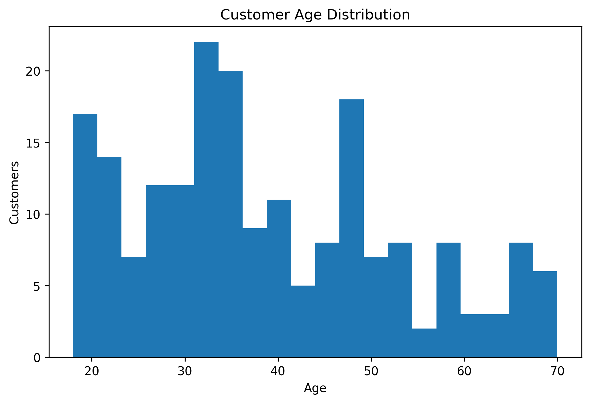
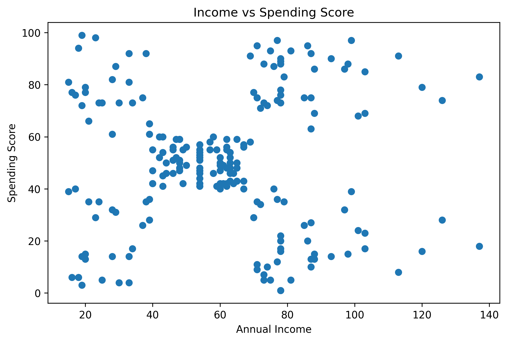
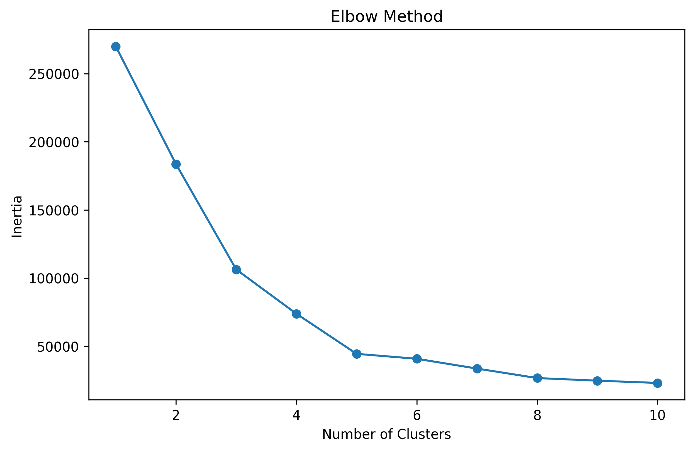
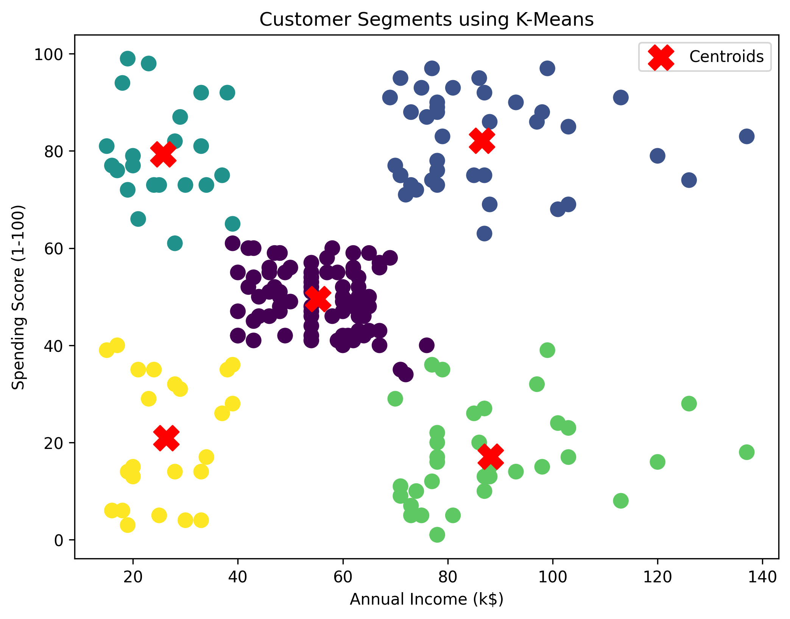
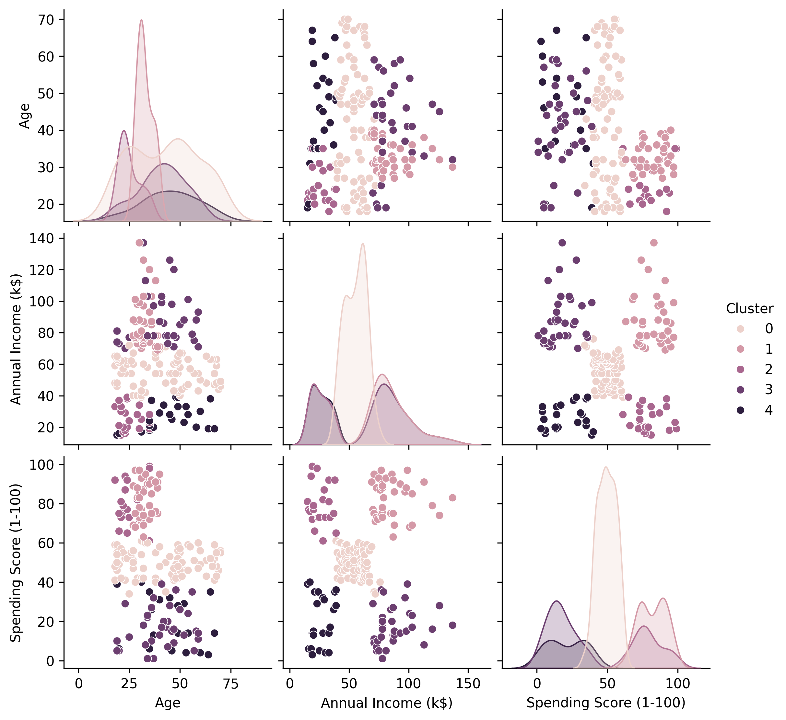

# Customer Segmentation

## Objective

Segment mall customers into distinct groups based on their purchasing behavior using the K-Means Clustering algorithm.

## Dataset

**Mall Customer Segmentation Dataset (Kaggle)**

The dataset contains demographic information and spending behavior of mall customers.

### Features Used

* Annual Income (k$)
* Spending Score (1-100)

## Tools

* Python
* Pandas
* NumPy
* Matplotlib
* Seaborn
* Scikit-learn
* Google Colab

## Machine Learning Technique

* K-Means Clustering

## Workflow

* Data loading and exploration
* Data cleaning
* Exploratory Data Analysis (EDA)
* Feature selection
* Elbow Method to determine the optimal number of clusters
* K-Means model training
* Cluster visualization
* Cluster analysis

## Visualizations

### Age Distribution

### Annual Income vs Spending Score

### Elbow Method

### Customer Segments

### Pair Plot of Customer Features

## Results

The Elbow Method identified **5** as the optimal number of clusters.

The K-Means algorithm successfully grouped customers into five distinct customer segments based on annual income and spending score.

The pair plot provides an additional visualization of the relationships among customer age, annual income, and spending score, helping illustrate how the clusters differ across multiple features.

## Conclusion

K-Means Clustering effectively segmented customers into meaningful groups using annual income and spending score. The resulting clusters reveal different purchasing patterns, such as high-income/high-spending customers, high-income/low-spending customers, and lower-income customer groups. These insights can support targeted marketing campaigns, customer profiling, and business decision-making.
