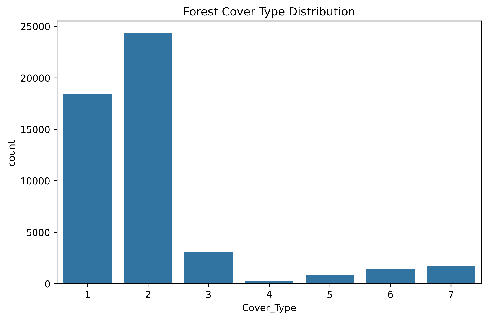
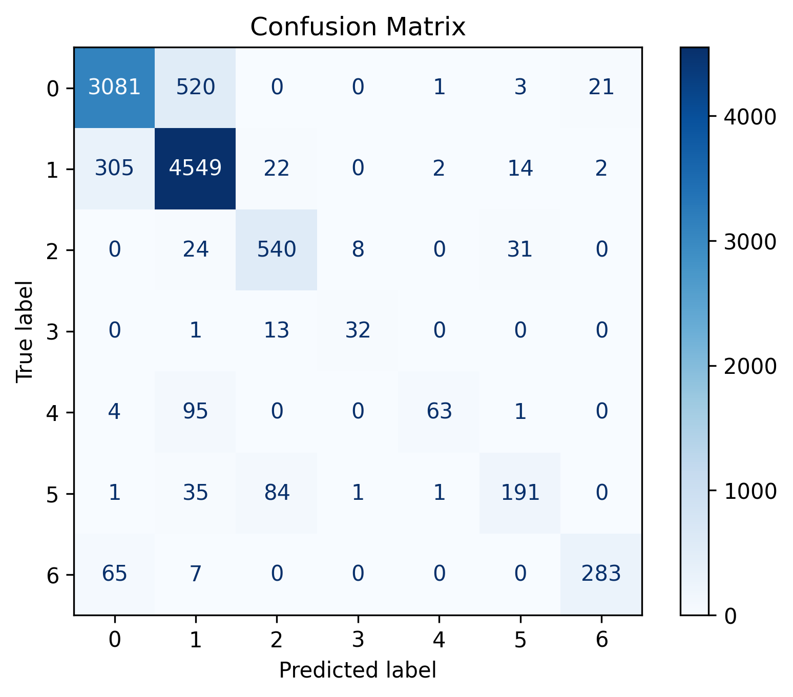
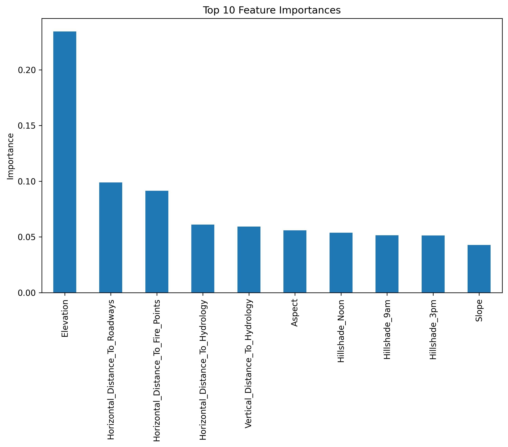
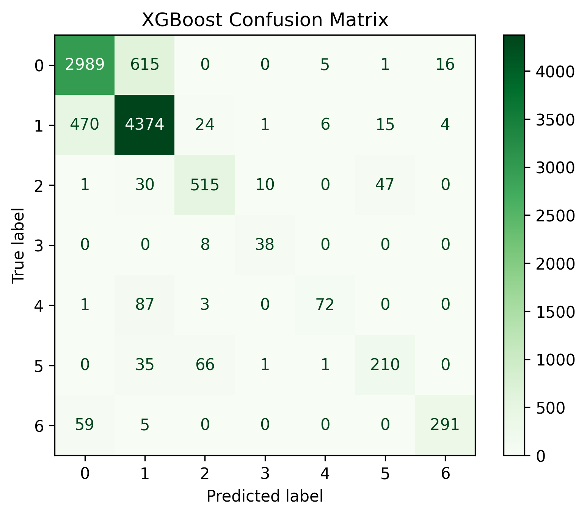
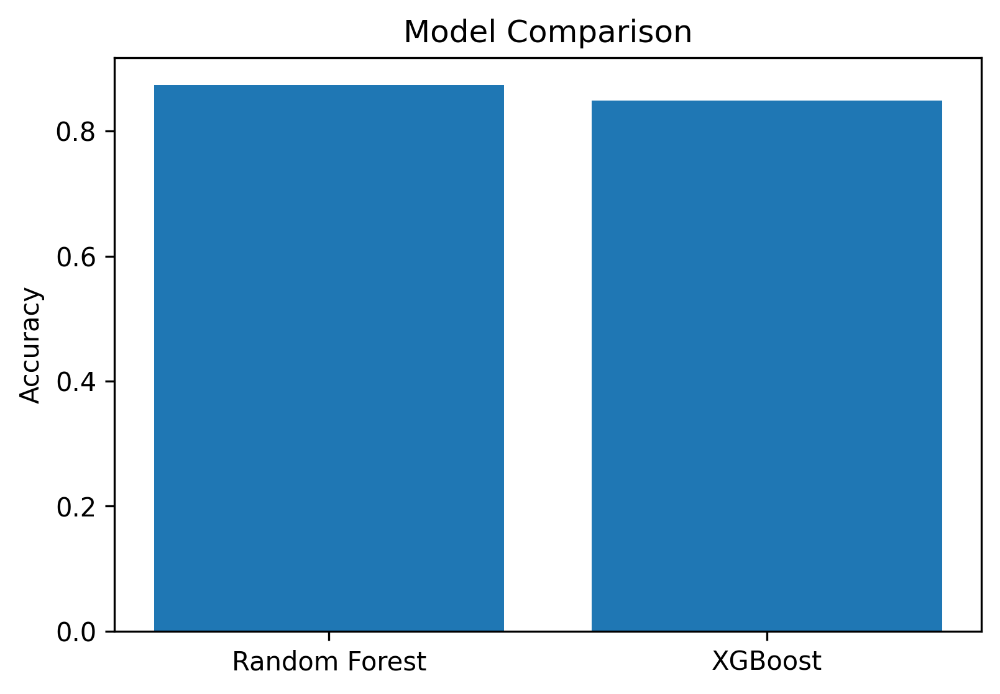

# Forest Cover Type Classification

## Objective

Build a machine learning model to classify forest cover types based on cartographic and environmental features using tree-based classification algorithms.

## Dataset

**Covertype Dataset (UCI Machine Learning Repository / Scikit-learn)**

The dataset contains cartographic variables describing forested areas and their corresponding forest cover types.

### Target Variable

* Cover_Type

### Features

The dataset contains 54 environmental and cartographic features, including:

* Elevation
* Aspect
* Slope
* Horizontal Distance to Hydrology
* Vertical Distance to Hydrology
* Horizontal Distance to Roadways
* Hillshade (9 AM, Noon, 3 PM)
* Horizontal Distance to Fire Points
* Wilderness Area
* Soil Type

## Tools

* Python
* Pandas
* NumPy
* Matplotlib
* Seaborn
* Scikit-learn
* XGBoost
* Google Colab

## Machine Learning Models

* Random Forest Classifier
* XGBoost Classifier

## Workflow

* Data loading and exploration
* Data cleaning
* Exploratory Data Analysis (EDA)
* Train-test split
* Random Forest model training
* Model evaluation
* Feature importance analysis
* XGBoost model training
* Model comparison
* Hyperparameter tuning using GridSearchCV

## Evaluation Metrics

* Accuracy
* Precision
* Recall
* F1-Score
* Confusion Matrix

## Results

| Model         |   Accuracy |
| ------------- | ---------: |
| Random Forest | **87.39%** |
| XGBoost       |     84.89% |

Random Forest achieved the highest accuracy and was selected as the final model.

## Visualizations

### Forest Cover Type Distribution

### Random Forest Confusion Matrix

### Top Feature Importances

### XGBoost Confusion Matrix

### Model Comparison

## Conclusion

Two tree-based classification algorithms were evaluated for predicting forest cover types. Random Forest achieved the best performance with an accuracy of **87.39%**, outperforming XGBoost on the sampled dataset. Feature importance analysis showed that terrain-related variables such as elevation and distance-based measurements were among the most influential predictors. The results demonstrate that ensemble learning methods are effective for multi-class forest cover classification.
