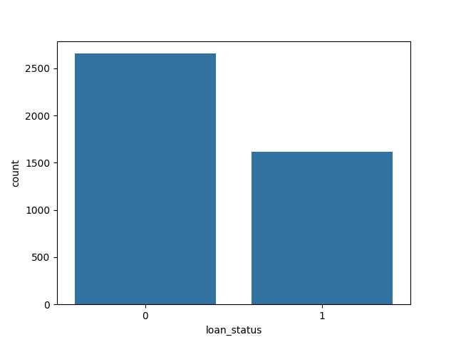
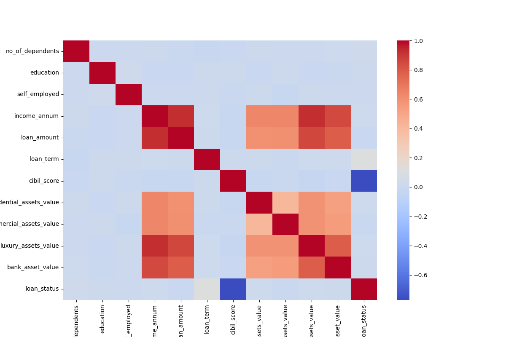
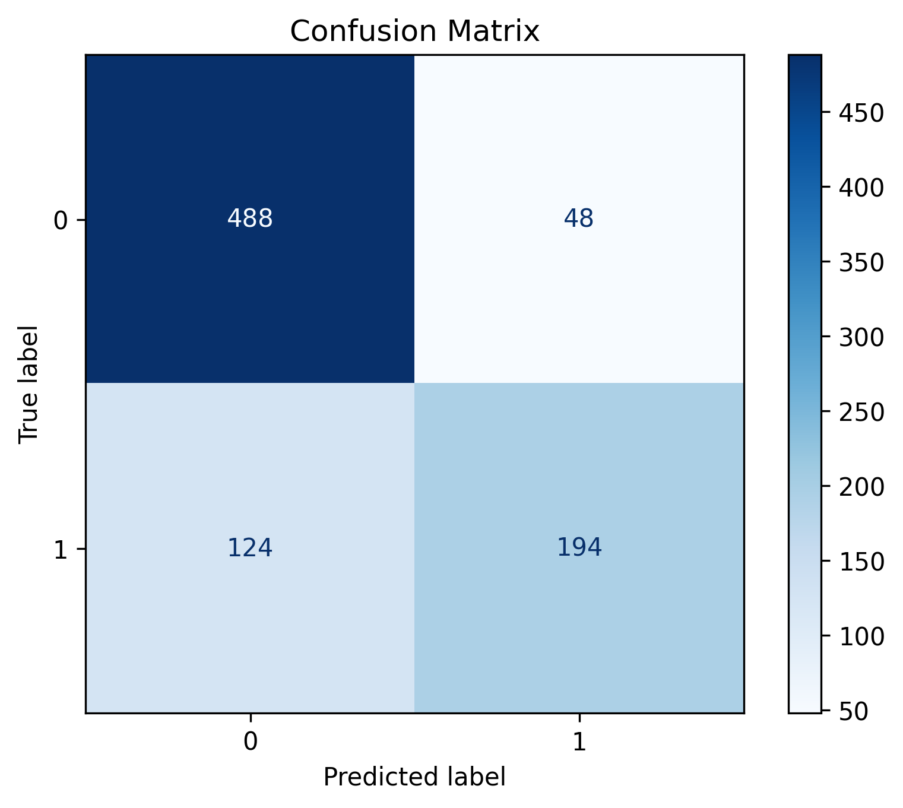
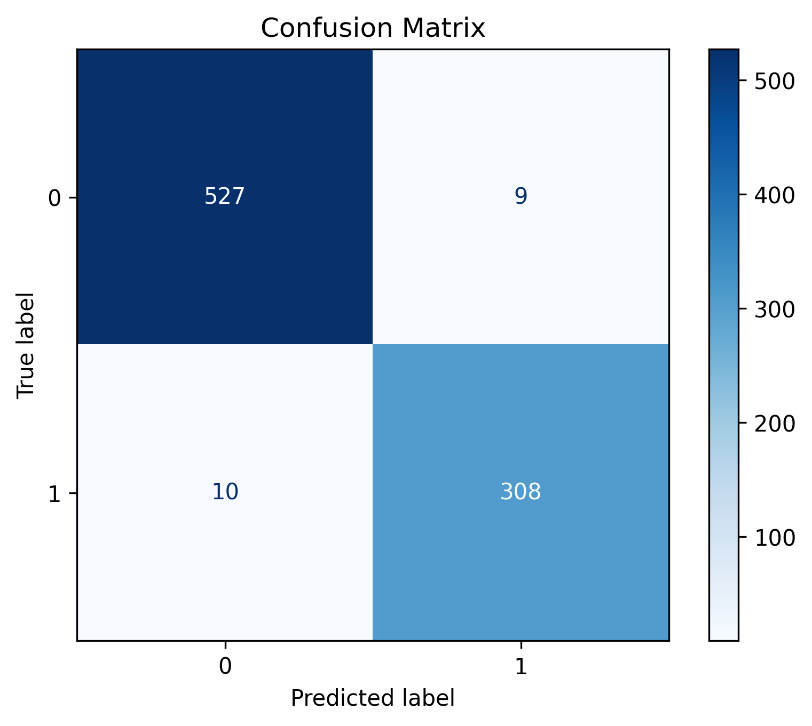
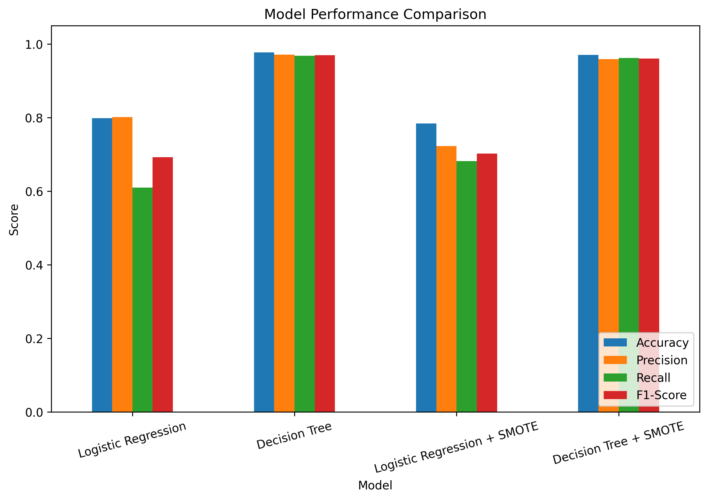

# Loan Approval Prediction

## Objective

Build a machine learning model to predict whether a loan application will be approved based on applicant information and financial details. This project also explores handling imbalanced data using SMOTE and compares the performance of different classification algorithms.

## Dataset

**Loan Approval Prediction Dataset (Kaggle)**

The dataset contains applicant information, financial details, and loan-related attributes used to predict loan approval status.

### Target Variable

* Loan_Status

### Features

The dataset includes features such as:

* Gender
* Married
* Dependents
* Education
* Self_Employed
* ApplicantIncome
* CoapplicantIncome
* LoanAmount
* Loan_Amount_Term
* Credit_History
* Property_Area

## Tools

* Python
* Pandas
* NumPy
* Matplotlib
* Seaborn
* Scikit-learn
* Imbalanced-learn (SMOTE)
* Google Colab

## Machine Learning Models

* Logistic Regression
* Decision Tree Classifier
* Logistic Regression with SMOTE
* Decision Tree with SMOTE

## Workflow

* Data loading and exploration
* Data cleaning
* Handling missing values
* Encoding categorical features
* Exploratory Data Analysis (EDA)
* Train-test split
* Logistic Regression model training
* Decision Tree model training
* Model evaluation
* Handling class imbalance using SMOTE
* Model comparison

## Evaluation Metrics

* Accuracy
* Precision
* Recall
* F1-Score
* Confusion Matrix

## Results

| Model                       |   Accuracy |  Precision |     Recall |   F1-Score |
| --------------------------- | ---------: | ---------: | ---------: | ---------: |
| Logistic Regression         |     79.86% |     80.17% |     61.01% |     69.29% |
| Decision Tree               | **97.78%** | **97.16%** | **96.86%** | **97.01%** |
| Logistic Regression + SMOTE |     78.45% |     72.33% |     68.24% |     70.23% |
| Decision Tree + SMOTE       |     97.07% |     95.92% |     96.23% |     96.08% |

## Visualizations

### Loan Status Distribution

### Correlation Heatmap

### Logistic Regression Confusion Matrix

### Decision Tree Confusion Matrix

### Model Comparison

## Conclusion

Four classification models were evaluated for loan approval prediction. Logistic Regression provided a strong baseline model, while the Decision Tree classifier achieved the highest overall performance. Applying SMOTE improved the recall of Logistic Regression but slightly reduced the performance of the Decision Tree. Based on the evaluation metrics, the **Decision Tree classifier** was selected as the final model, achieving **97.78% accuracy**, **97.16% precision**, **96.86% recall**, and an **F1-score of 97.01%**.
