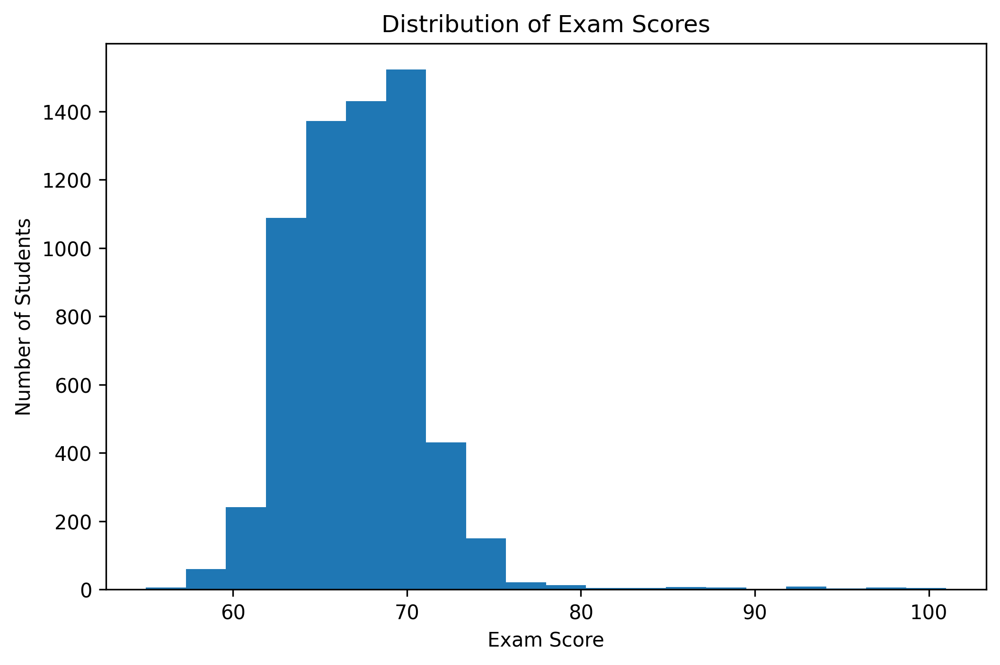
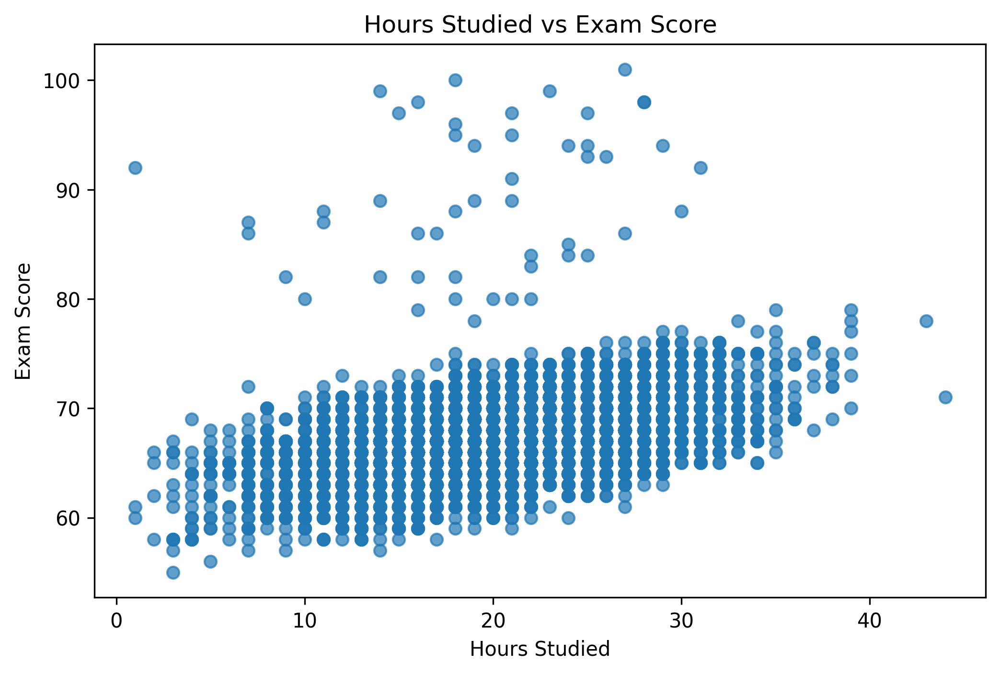
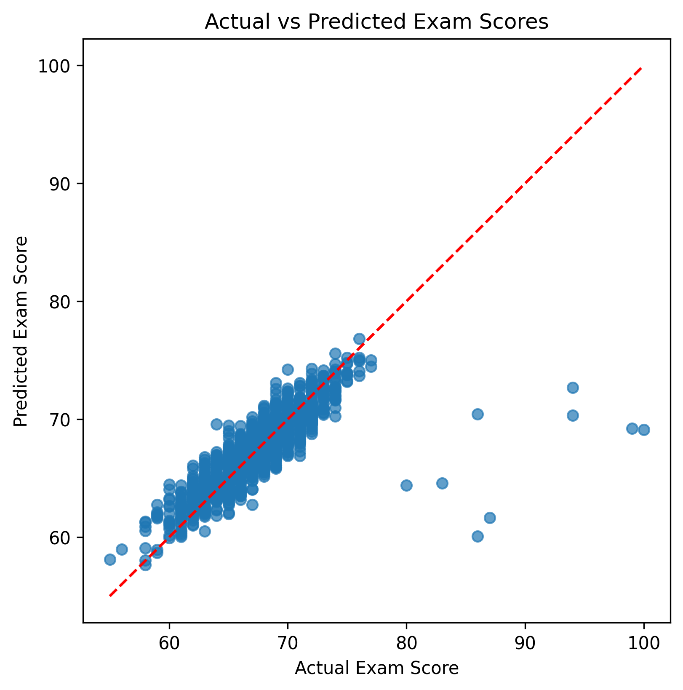

# Student Score Prediction

## Objective

Build a machine learning model to predict students' exam scores based on academic and behavioral factors using regression techniques.

## Dataset

**Student Performance Factors Dataset (Kaggle)**

The dataset contains information about students' academic performance and factors that may influence exam scores.

Target variable:

* `Exam_Score`

Features used:

* `Hours_Studied`
* `Attendance`
* `Previous_Scores`
* `Tutoring_Sessions`

## Tools & Libraries

* Python
* Pandas
* NumPy
* Matplotlib
* Scikit-learn
* Google Colab

## Machine Learning Approach

The following steps were performed:

1. Data loading and exploration
2. Data cleaning and preprocessing
3. Exploratory Data Analysis (EDA)
4. Feature selection
5. Train-test split
6. Model training
7. Model evaluation
8. Model comparison

## Models Compared

### 1. Linear Regression

Three feature combinations were tested:

| Model   | Features                                                         | MAE      | RMSE     | R²        |
| ------- | ---------------------------------------------------------------- | -------- | -------- | --------- |
| Model 1 | Hours Studied                                                    | 2.53     | 3.51     | 0.205     |
| Model 2 | Hours Studied + Attendance                                       | 1.53     | 2.65     | 0.548     |
| Model 3 | Hours Studied + Attendance + Previous Scores + Tutoring Sessions | **1.33** | **2.46** | **0.610** |

### 2. Polynomial Regression

Polynomial Regression (degree 2) was tested to determine whether adding nonlinear relationships could improve performance.

Results showed that Polynomial Regression did not improve the model compared to Linear Regression.

## Visualizations

### Exam Score Distribution

### Hours Studied vs Exam Score

### Actual vs Predicted Scores

## Conclusion

The best-performing model was **Linear Regression using Hours Studied, Attendance, Previous Scores, and Tutoring Sessions**, achieving:

* MAE: **1.33**
* RMSE: **2.46**
* R² Score: **0.610**

Adding polynomial features did not improve performance, suggesting that the relationship between the selected features and exam scores is approximately linear. Therefore, Linear Regression was selected as the final model because it provided better performance while remaining simple and interpretable.
